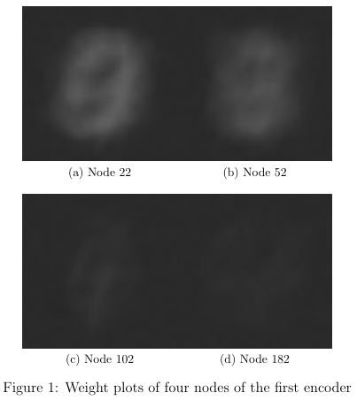
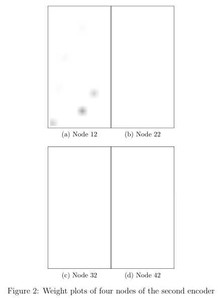

# Assignment 1

## Introduction

Our team is consisted by Dafni Lappa and Epameinondas-Spyridon Themelis. We implemented the assignment in Python 3.7, using scikit-learn, PyTorch and numpy libraries among others. In the following sections, we will provide an in depth analysis of our implementation and explainations on our results.

## Support Vector Machines

Support vector machines are supervised learning models used in classification and regression problems. They find the hyperplane that maximizes the margin between two classes using the vectors that define the hyperplane. SVMs are binary linear classifiers that can also perform a non-linear classification using a Kernel function that takes as inputs vectors in the original space and returns the dot product of the vectors in the feature space. So essentially, we use a Kernel function to transform a non-linear space into a linear one.

### Question 1

The goal is to train SVM classifiers to recognize digits from 0 to 9. SVMs are binary classifiers, i.e. they can classify an input into two labels, therefore we constructed 45 binary classifiers by splitting mnist.train.csv dataset into multiple datasets for all possible pairs of digits. In order to implement SVM models, we used from scikit-learn library the SVC class (SVM for classification). Therefore, for each label pair, we unified the respective datasets and then, using StratifiedShuffleSplit from scikit-learn we created training and validation datasets. We used the radial kernel function, so we created two arrays with values for the parameter C and sigma. Then, for every pair of digits we created a SVC model for all values of C and sigma trained with the training dataset (using the fit method). In order to find the best model we tested them with the validation set, estimated its accuracy (using accuracy\_score from scikit-learn.metrics) and selected the one with the highest accuracy.

To find the most and least similar digits to five, we tested all the classifiers being trained with the digit 5 with the respective pairwise test datasets (using the predict method). Thus, we get the classifier's predictions and, using the accuracy score method, we obtain the accuracies for each SVC model. The model with the poorest accuracy (70%) was the classifier for 3 and 5 while the classifier with the best accuracy (99%) was the one for 0 and 5. Therefore, we can say that the most similar digit to 5 is 3 and the least similar one is 0. We came to this conclusion since the poorest accuracy means that the classifier cannot easily distinguish the two digits, which means that they should be similar. On the other hand, when a classifier has the highest accuracy, this means that the two digits are not very similar and the classifier can distinguish the items of two classes/labels.

### Questions 2 & 3 - Majority vote

For the purposes of these two questions a Nx10 matrix filled with zeros was created (N=items in the test dataset, 10= number of possible classes). For each prediction of the classifiers, we increased the value of the respective position (i.e. the item's and label's position) of the matrix by 1. The argmax function from numpy library was applied in order to obtain the label (column index) with the max counter value for every observation. After finishing this process, we measured the accuracy of the majority vote system by using the accuracy\_score function from scikit-learn, which was *69%*.

Moreover, we iterated the possible classes and we stored in a list the predictions of test data with true label the one examined each time. In order to calculate the respective accuracy (we used the same library as in the previous question), we created a vector with the same size as the aforementioned list, containing only the true label. Table 1 in appendix A shows the accuracies per digit. One possible reason for the differencies in the accuracies is that the shape of numbers 0, 1 or 4 (which have the best accuracies) is not very similar to the other digits' shapes, therefore the classifiers can easily distinguish them. On the other hand, numbers such as 5, 8 or 9 (with very poor accuracies) have similar to other digits' shapes and can be easily misclassified.

Finally, we prepared the results for question 4. The prediction vector of each label pair  is transformed into a vector with zeros (for the first label) and ones (for the second label). The trasnformed prediction vectors are then concatenated using hstack. Additionally, respective true labels are replaced by 10-dimensional vectors containing 1 in the label's position and zeros in all other positions.

## Artificial Neural Networks

Artificial Neural Networks (ANNs) are computational models and their structure is affected by the information which flows through it. Thus, the network learns to perform tasks without following rule-based instructions. An ANN has an input layer, one or more hidden layers and an output layer, which are consisted of connected nodes (i.e. neurons). In question 4, we were asked to create a Neural Network with one hidden layer and one output layer. We experimented with four different sizes of the hidden layer (H = {5, 10 ,15, 20}) while the output layer had a fixed size of 10 neurons, representing the number of possible classes/labels (i.e. digits).

### Question 4

We used MLPClassifier from scikit-learn, which was trained and evaluated with 4 different sizes of its hidden layer (5,10,15 and 20). The ANN was evaluated using 10-fold cross-validation on the dataset acquired from the previous question (implemented using KFold from scikit-learn) with 1000 iterations. Table 2 in appendix B shows the relevant accuracies for each hidden layer size (the best accuracy is for size H=20).

## Deep Learning - Auto encoders

Auto encoders are an unsupervised type of ANN used for encoding a dataset in order to reduce dimensionality. Initially, they learn to represent a set of data in smaller dimensional space (encoding) and then try to reconstruct as accurate as possible the original input (decoding). So, auto encoders try to copy the input to their output by minimizing the loss of information in this process.

### Question 5 -ANN training using auto-encoders

We implemented the requested topology using PyTorch framework. We created two classes, the DeepNN class which extends the nn.Module from torch (represents the network - an encoder), the Dset class (representing a dataset). The DeepNN overrides the method forward which uses a linear function in the input layer, the sigmoid function in the encoder layer and again a linear function for the output of each encoder. First of all, we tested the accuracy of the ANN in question 4 by giving as input the initial dataset (784 dimensional vector). The network had a much higher accuracy (i.e. *94%*) than in question 4, where the majority votes were given as input vector.

The next step was to train an encoder to reduce the dimensionality of 784 features to a 200 dimensional vector. For the encoder's training, we used the torch class DataLoader and the methods SGD (for the optimizer) and MSELoss. We run the training process for 1000 epochs and with batch size 100. The accuracy of this layer, used as input in the ANN of question 4, was *70%*. It seems that the network looses important information during the encoding process which cannot be retrieved afterwards. Finally, we created a second encoder to reduce the dimensionality from 200 to 45, following the same training process. The output of this layer is then provided to the same ANN model which had accuracy *11%*.

The accuracy between the input and the first hidden layer is reduced from 94% to 70%, which implies that an amount of information is lost. The errors of the first encoder are inherited to the second one and as a result the final accuracy of the system is *11%*. The ANN model from question 4 achieves a much higher accuracy with input the majority votes of the SVMs rather than performing dimension reduction using the two encoders. The use of an ensamble of classifiers (majority votes from SVM models and ANN) is a strategy that usually performs well since marginal errors and outliers are smoothed out.

### Question 6 & 7 - Visualize features from the encoders

Regarding the 200 nodes of the first encoder, we plotted for each node all the weights into a 28x28 image. We produced 200 images and we provide a sample in appendix C. Similarly, we plotted the weights of each node of the second encoder and produced 45 images of 20x10, also included in appendix C. In the previous subsection, we used the accuracy\_score method to show the difference between the input layers features and the encodings of the first hidden layer. In the first hidden layer the accuracy score is 0.70 and therefore the nodes keep a pattern of the digits, as we can see in the images in the appendix C. In figure 1, showing 4 plots of the weights of 4 nodes of the first encoder, we can distinguish the digits, although they are not as clear as in the initial pictures. On the other hand, the plots of the second encoder, in figure 2 have kept only the information in the white pixels (i.e. the digits), however we cannot extract any useful information from the features of the second encoder. Thus, the accuracy score falls to 11%.

## Dimension Reduction

There are several techniques for dimensonality reduction such as PCA and random projection. PCA uses orthogonal transformation to project the input space into a new smaller one where the data have the most variance. When we have a large set of correlated variables, principal components summarize this set with a smaller number of representative variables that explain most of the variability in the original set. Random projection method reduces dimensonality of observations in a dataset that lie in Euclidean space. It preserves distances well, however empirical results are sparse.

### PCA and Random Projection

The first method for dimensionality reduction that we applied was PCA. As training and test datasets, we used the initial data from the respective csv files. The data were given as input in a PCA object from the scikit-learn library with 100 components, which applied the fit\_transform method to the training set and the transform method to the test data. The output of the training set was then provided as input to retrain the ANN model from question 4. The model was then tested with the output of the transform method (the new test data). The accuracy of PCA and ANN from question 4 was *93%*.

The second method we chose was Random Projection. Scikit-learn library provides two implementations of this method: the Gaussian Random Projection and the Sparse Random Projection. We transformed the training and test datasets using the Gaussian Random Projection with 100 components and then retrained the ANN of question 4 with the new training data. The network was then tested with the test data transformed by the Gaussian Random Projection and the accuracy was *93%*.

## Conclusions

### Best performing predictor

The best performing predictor is the one using the 784 features as input to the ANN is a data-driven end-to-end approach (94%). This method does not have any specific task-rule and the network is able to discover useful internal representations directly from the raw input pictures. It seems that it works well by finding useful features for classification tasks. In addition, when using PCA or random projection for dimensonality reduction purposes and providing their output as input to the ANN follows with a very high score (93%) close to the best predictor. It appears that these projection methods that transform the input space into vector space suit the classification tasks exceptionally well.

### Improve performance of other predictor

One predictor that did not have a very good performance was the auto-encoders whose output was given as input to the ANN (accuracy score 70% for the first one and 11% for the second one). In order to improve their performance we could deepen the encoding architecture by adding more layers to arrive at the desired encodings size more gradually. Furthermore, a regularization term could be added to the training loss to reduce possible overfitting. Some difficulties of this process could be the training time because the number of parameters in the model is increased. Another possible difficulty may be the need for a larger dataset.

## Appendix

### Appendix A

This appendix is used in order to provide some results from the questions of the assignment. To begin with, we include the below table where we show the accuracies of the majority votes per label, as required in question 3.

| Labels     | 0    | 1    | 2    | 3    | 4    | 5    | 6    | 7    | 8    | 9    |
|------------|------|------|------|------|------|------|------|------|------|------|
| Accuracies | 0.95 | 0.96 | 0.63 | 0.86 | 0.90 | 0.32 | 0.78 | 0.80 | 0.28 | 0.30 |

### Appendix B

In appendix B, regarding the ANN in question 4, we provide the accuracies for all the tested hidden layer sizes in the table below.

| Sizes      | 5    | 10   | 15   | 20   |
|------------|------|------|------|------|
| Accuracies | 0.69 | 0.74 | 0.75 | 0.76 |

### Appendix C

In this appendix, we will provide some sample plots related to some nodes of each encoder. For the first encoder (hidden layer 200), we provide plots from the 22,52,102 and 182 nodes. Moreover, we include below four representative images for the second encoder (hidden layer 45) from the 12, 22, 32 and 42 nodes.

